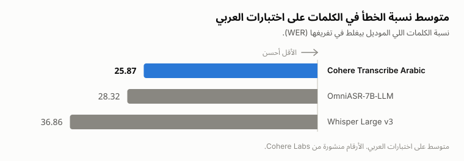

<div align="center">

# رقيم · raqeem

### تفريغ الصوت العربي من غير GPU ولا PyTorch ولا أوزان محلية.

[English](README.md) · **العربية**

[](https://crates.io/crates/raqeem)
[](https://pypi.org/project/raqeem/)
[](https://pypi.org/project/raqeem/)
[](https://github.com/SufficientDaikon/raqeem/actions/workflows/ci.yml)
[](LICENSE)

</div>

`raqeem` أداة صغيرة بتشغّل موديل [`CohereLabs/cohere-transcribe-arabic-07-2026`](https://huggingface.co/CohereLabs/cohere-transcribe-arabic-07-2026)،
موديل كوهير المفتوح للتعرف على الكلام العربي (Apache-2.0). تديها ملف صوت، تجيب لك نص عربي:
من بايثون، أو من التيرمينال، أو من أي لغة تقدر تقرا stdout.

مافيش أوزان بتتحمّل محلياً. الـ inference بيروح لـ endpoint إنت اللي بتختاره — API كوهير الجاهز،
أو سيرفر vLLM بتاعك — فاللي بيتركب عندك ملف تنفيذي صغير، أو مكتبة بايثون متجمّعة، من غير `torch`
ولا CUDA ولا أي حاجة تتنزّل غير الأداة نفسها.

> المشروع ده موجود عشان Cohere Labs طلّعوا موديل ASR عربي مفتوح بجد برخصة Apache-2.0، والحاجة دي
> تستاهل on-ramp محترم للمطورين. الدقة كلها شغلهم — الريبو ده مجرد الـ ergonomics اللي حواليه.

## البداية السريعة

```bash
pip install raqeem
export COHERE_API_KEY=...          # مفتاح مجاني من dashboard.cohere.com/api-keys
```

```python
import raqeem

t = raqeem.transcribe("voice_note.ogg")   # عربي by default
print(t.text)                             #  → الطماطم بـ ١٢٫٥ جنيه
print(t.text_normalized)                  #  → الطماطم ب 12.5 جنيه
```

الـ wheel بيديك مكتبة بايثون بس. لو عايز أمر `raqeem` نفسه في التيرمينال، لازم تركّب الملف التنفيذي:

```bash
cargo install raqeem      # أو نزّل واحد جاهز من Releases
raqeem voice_note.ogg
```

## إيه اللي بتاخده

- **أدق موديل عربي مفتوح موجود.** موديل Cohere Conformer (2B) أحسن بحوالي **11 نقطة WER** من
  Whisper Large v3، وبيمسك كويس في أصعب حتة في العربي: اللهجات (مصري، خليجي، شامي، مغربي)
  والخلط بين العربي والإنجليزي. [الأرقام تحت](#مقارنة-الأداء).
- **مافيش حاجة تقيلة بتتركب.** الأداة مابتحمّلش أوزان ومابتشغّلش موديل. بتبعت الصوت وبترجّع النص
  بعد معالجة بسيطة، وخلاص — ملف تنفيذي ساكن، و wheel من غير `torch`.
- **إنت اللي بتحدد الـ inference بيحصل فين.** API كوهير لما ماتكونش عايز تدير أي بنية تحتية، أو
  vLLM بتاعك لما تكون عايز من غير rate limits ومن غير ما الصوت يخرج من الشبكة بتاعتك. نفس الواجهة.
- **كل تفريغ بيرجع بشكلين.** النص الحرفي زي ما الموديل قاله، ونسخة معالجة للعربي: توحيد الألف
  والهمزات، التاء المربوطة والتطويل، **إزالة** التشكيل، وتحويل الأرقام العربية-الهندية لـ ASCII.
  `١٢٫٥` بتبقى `12.5` رقم **واحد** مش اتنين. ده الفرق بين نص إنت تقدر تقراه ونص برنامج يقدر يفهمه.
- **بتتنده من أي حاجة.** نواة Rust، و wheel بايثون native، وملف تنفيذي بيطبع JSON — يعني Go و
  Node وسكربت شل و cron كلهم بيشغّلوا نفس المحرك.

## التثبيت

**عبر Python** — مكتبة متجمّعة، من غير `torch` ولا subprocess:

```bash
pip install raqeem
```

ده بيديك `import raqeem`. مش بيحط أمر `raqeem` في الـ `PATH` — للحاجة دي استعمل واحدة من التلاتة اللي تحت.

**عبر cargo** — بيركّب الملف التنفيذي `raqeem`:

```bash
cargo install raqeem
```

**ملف تنفيذي جاهز** — نزّل واحد لـ Linux / macOS / Windows من
[Releases](https://github.com/SufficientDaikon/raqeem/releases). من غير runtime ومن غير أي dependencies.

**التجميع من المصدر:**

```bash
git clone https://github.com/SufficientDaikon/raqeem
cd raqeem && cargo build --release   # الملف في target/release/raqeem
```

## الاستخدام

### 1. API كوهير الجاهز

```bash
export COHERE_API_KEY=your_api_key
raqeem voice_note.ogg --lang ar
```

### 2. سيرفر vLLM بتاعك

```bash
# على سيرفر الـ GPU عندك:
# vllm serve CohereLabs/cohere-transcribe-arabic-07-2026 --trust-remote-code

raqeem clip.wav \
  --provider openai \
  --endpoint http://localhost:8000/v1/audio/transcriptions \
  --model CohereLabs/cohere-transcribe-arabic-07-2026 \
  --lang ar
```

مافيش GPU خالص؟ [`examples/serve_local.py`](examples/serve_local.py) بيقدّم نفس المسار
المتوافق مع OpenAI من على المعالج (CPU). بس خد بالك إن السكربت ده هو النص التقيل من الحكاية —
عايز `torch` و `transformers` وحوالي 8-10 جيجا رام، وده بالظبط اللي الأداة اللي فوق بتتجنبه.
شغّله على الجهاز اللي يستحمل، ووجّه `raqeem` عليه.

### 3. مخرجات JSON

```bash
raqeem voice_note.ogg --format json
```

```json
{
  "text": "الطماطم بـ ١٢٫٥ جنيه",
  "text_normalized": "الطماطم ب 12.5 جنيه",
  "provider": "cohere",
  "model": "cohere-transcribe-arabic-07-2026",
  "language": "ar"
}
```

الـ JSON ده هو الواجهة اللي أي لغة تقدر تستهلكها: نادي الأداة من بايثون أو Node أو Go أو أي حاجة.
خد بالك إن `--provider openai` بيسجّل `"provider": "openai-compatible"` مش `"openai"` — الفلاج
بيسمّي الإعداد، والحقل بيسمّي شكل البروتوكول.

### مرجع الأوامر

| الخيار | الافتراضي | الملاحظات |
|---|---|---|
| `--provider` | `cohere` | `cohere` أو `openai`. التاني محتاج `--endpoint` و `--model`. |
| `--endpoint` | — | الـ URL الكامل لسيرفر متوافق مع OpenAI عندك. بيترفض مع `--provider cohere`، لأن ده بيروح لكوهير على طول. |
| `--api-key` | — | بيرجع لـ `$RAQEEM_API_KEY` لو مااتحطش. شوف الملاحظة تحت. |
| `--model` | `cohere-transcribe-arabic-07-2026` | كوهير بتشترط معرّف **مؤرّخ**؛ الأسماء غير المؤرّخة بترجّع 404. |
| `--lang` | `ar` | ISO-639-1. |
| `--timeout` | `300` | بالثواني، وبتغطي الرفع + الـ inference + التنزيل. زوّدها لو الـ CPU بطيء. |
| `--format` | `text` | `text` أو `json`. |

مفتاح `$COHERE_API_KEY` بتاع كوهير **مابيتبعتش أبداً** لـ `--endpoint` محلي أو خاص — المفتاح ده
بتاع كوهير ومالوش لازمة على سيرفر حد تاني. لكن `--api-key` و `$RAQEEM_API_KEY` مفاتيحك إنت،
فبيروحوا لأي حتة توجّه الأداة عليها، بما فيها endpoint محلي محتاج auth.

## استخدام مكتبة بايثون

نفس المحرك، من غير subprocess. الـ keyword arguments هي نفس الفلاجات اللي فوق.

```python
import raqeem

# بيقرا $RAQEEM_API_KEY، وبعدين $COHERE_API_KEY
t = raqeem.transcribe("voice_note.ogg", lang="ar")
print(t.text)              # النص الحرفي، للبني آدمين
print(t.text_normalized)   # النص المعالج، للبرامج
print(t.to_dict())         # نفس شكل ‎--format json

# سيرفر vLLM بتاعك
t = raqeem.transcribe(
    "clip.wav",
    provider="openai",
    endpoint="http://localhost:8000/v1/audio/transcriptions",
    model="CohereLabs/cohere-transcribe-arabic-07-2026",
)

# دالة معالجة النص العربي لوحدها
raqeem.normalize_ar("الطماطم بـ ١٢٫٥ جنيه")   # 'الطماطم ب 12.5 جنيه'
```

أي فشل في التفريغ بيرمي `raqeem.TranscriptionError`. و provider غلط أو مفتاح/endpoint ناقص
بيرمي `ValueError`.

## اللي اتجرب فعلاً

- **الاختبارات الآلية.** `cargo test` بيغطي معالجة النص العربي، وجسم الـ multipart (بما فيه ترتيب
  الحقول اللي كوهير مصمّمة عليه)، ونقل الأخطاء من endpoint متزيّف. من غير إنترنت ولا مفتاح ولا موديل.
  ومكتبة بايثون بتعيد نفس اختبارات المعالجة عشان التنفيذين مايفرقوش عن بعض.
- **اتجرب حي على كوهير.** صوت حقيقي من خلال الـ wheel والملف التنفيذي — ملف 611 كيلوبايت رجع في
  حوالي ثانيتين.
- **اللي ماتجربش حي: المسار المحلي.** `--provider openai` عليه mock tests قدام سيرفر متزيّف، بس
  مافيش حاجة هنا كلّمت كلوستر vLLM حقيقي. و `examples/serve_local.py` مالوش اختبارات خالص
  وماتشغّلش من الأول للآخر على الأوزان الحقيقية؛ هو ماشي على الـ API الموثّق في كارت الموديل،
  فلو اسم اتغيّر في نسخة `transformers` عندك الإصلاح صغير.
- **ملاحظات مهمة.** كوهير بترفض الطلب إلا لو حقول `model` و `language` جت **قبل** جزء الملف في
  الـ multipart. والمعرّفات غير المؤرّخة بترجّع HTTP 404.

## مقارنة الأداء

<picture>
  <source media="(prefers-color-scheme: dark)" srcset="assets/wer-ar-dark.svg">
  
</picture>

<details>
<summary>نفس الأرقام كنص</summary>

| الموديل | متوسط WER ↓ |
|---|---|
| **Cohere Transcribe Arabic** | **25.87** |
| OmniASR-7B-LLM | 28.32 |
| Whisper Large v3 | 36.86 |

الأرقام منشورة من Cohere Labs.

</details>

الموديل بيرجّع نص عادي وبس. الـ timestamps و speaker diarization و VAD حاجات في خارطة طريق
`raqeem`، مش حاجات الموديل بيديها لنا دلوقتي.

## الصيغ الصوتية المدعومة

`flac`, `mp3`, `mpeg`, `mpga`, `ogg`, `wav` — والليستة دي بتاعة الـ endpoint مش بتاعتنا. `raqeem`
أصلاً مابيبصش على امتداد الملف ومابيفكّش أي ترميز؛ بيرفع البايتات زي ما هي ويسيب السيرفر يقرر.

## ملاحظة عن الوصول للموديل

الأوزان برخصة Apache-2.0، بس صفحة الموديل على Hugging Face ورا فورم موافقة. يعني هتحتاج تطلب
وصول عشان تقرا الكارت. مافيش حاجة في `raqeem` محتاجة ده — الـ API الجاهز عايز مفتاح كوهير وبس —
لكن اللينك اللي فوق مش هيفتح لك من غير الطلب.

## المساهمة

الـ issues والـ PRs مرحّب بيها. بص على [CONTRIBUTING.md](CONTRIBUTING.md)، وعلى
[.claude/skills/](.claude/skills/) لو بتضيف backend جديد للتفريغ — فيه skill بيمشّيك على
التلات تعديلات اللي محتاجينها.

## الرخصة

[Apache-2.0](LICENSE) — نفس رخصة الموديل.
