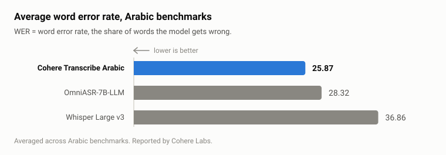

<div align="center">

# رقيم · raqeem

### Arabic speech-to-text without a GPU, PyTorch, or local weights.

**English** · [العربية](README.ar.md)

[](https://crates.io/crates/raqeem)
[](https://pypi.org/project/raqeem/)
[](https://pypi.org/project/raqeem/)
[](https://github.com/SufficientDaikon/raqeem/actions/workflows/ci.yml)
[](LICENSE)

</div>

`raqeem` is a small client for [`CohereLabs/cohere-transcribe-arabic-07-2026`](https://huggingface.co/CohereLabs/cohere-transcribe-arabic-07-2026),
Cohere's open Arabic speech-recognition model (Apache-2.0). Hand it an audio file, get Arabic
text back: from Python, from the terminal, or from any language that can read stdout.

It carries no model weights. Inference goes to an endpoint you pick — Cohere's hosted API, or
your own vLLM — so what you install is one small binary, or a compiled Python extension, with no
`torch`, no CUDA, and nothing to download but the tool itself.

> Built out of respect for Cohere Labs' work: a genuinely open, Apache-2.0 Arabic ASR model
> deserves a first-class developer on-ramp. All accuracy credit is theirs — this repo is just
> the ergonomics around it.

## Quickstart

```bash
pip install raqeem
export COHERE_API_KEY=...          # a free key from dashboard.cohere.com/api-keys
```

```python
import raqeem

t = raqeem.transcribe("voice_note.ogg")   # Arabic by default
print(t.text)                             #  → الطماطم بـ ١٢٫٥ جنيه
print(t.text_normalized)                  #  → الطماطم ب 12.5 جنيه
```

The wheel ships the Python extension only. If you want the `raqeem` command, install the binary:

```bash
cargo install raqeem      # or download one from Releases
raqeem voice_note.ogg
```

## What you get

- **The best open Arabic ASR there is.** Cohere's 2B Conformer model runs about **11 WER points**
  ahead of Whisper Large v3, and holds up where Arabic gets hard: dialects (Egyptian, Gulf,
  Levantine, Maghrebi) and Arabic-English code-switching. [Numbers below](#benchmarks).
- **Nothing heavy gets installed.** The client loads no weights and runs no model. It POSTs your
  audio and folds the reply, and that's the entire job — a static binary, a `torch`-free wheel.
- **You choose where inference runs.** Cohere's hosted API when you want zero infrastructure, or
  your own vLLM when you want no rate limits and no audio leaving your network. Same interface.
- **Two forms of every transcript.** The model's verbatim text, plus an Arabic-normalized form:
  alef/hamza folded, taa-marbuta and tatweel and diacritics handled, Arabic-Indic digits turned
  to ASCII, and the invisible characters that ride along with copied RTL text — zero-width
  joiners, bidi marks, a stray BOM — removed. `١٢٫٥` becomes `12.5` as **one** number. That's
  the difference between a transcript you can read and one a program can parse.
- **Callable from anything.** Rust core, native Python wheel, and a binary that prints JSON — so
  Go, Node, a shell script, or a cron job all drive the same engine.

## Install

**Python** — a compiled extension, no `torch`, no subprocess:

```bash
pip install raqeem
```

That gives you `import raqeem`. It does not put a `raqeem` command on your `PATH` — use one of
the next three for that.

**With cargo** — installs the `raqeem` binary:

```bash
cargo install raqeem
```

**Prebuilt binary** — grab one for Linux / macOS / Windows from
[Releases](https://github.com/SufficientDaikon/raqeem/releases). No runtime, no dependencies.

**From source:**

```bash
git clone https://github.com/SufficientDaikon/raqeem
cd raqeem && cargo build --release   # binary at target/release/raqeem
```

## Usage

### Cohere's hosted API

```bash
export COHERE_API_KEY=your_api_key
raqeem voice_note.ogg --lang ar
```

### Your own vLLM

```bash
# on the GPU box:
# vllm serve CohereLabs/cohere-transcribe-arabic-07-2026 --trust-remote-code

raqeem clip.wav \
  --provider openai \
  --endpoint http://localhost:8000/v1/audio/transcriptions \
  --model CohereLabs/cohere-transcribe-arabic-07-2026 \
  --lang ar
```

No GPU anywhere? [`examples/serve_local.py`](examples/serve_local.py) serves the same
OpenAI-compatible route off the CPU. That script is the heavy half of the deal — it wants
`torch`, `transformers`, and roughly 8-10 GB of RAM, which is exactly what the client above
avoids. Run it on the machine that can afford it and point `raqeem` at it.

### JSON output

```bash
raqeem voice_note.ogg --format json
```

```json
{
  "text": "الطماطم بـ ١٢٫٥ جنيه",
  "text_normalized": "الطماطم ب 12.5 جنيه",
  "provider": "cohere",
  "model": "cohere-transcribe-arabic-07-2026",
  "language": "ar"
}
```

That JSON contract is the language-agnostic API: shell out from Python, Node, Go, anything.
Note that `--provider openai` records `"provider": "openai-compatible"`, not `"openai"` — the
flag names the preset, the field names the wire format.

### CLI reference

| Flag | Default | Notes |
|---|---|---|
| `--provider` | `cohere` | `cohere` or `openai`. The latter needs `--endpoint` and `--model`. |
| `--endpoint` | — | Full URL of a self-hosted OpenAI-compatible server. Rejected with `--provider cohere`, which always posts to Cohere. |
| `--api-key` | — | Falls back to `$RAQEEM_API_KEY`. Prefer the env var — see below. |
| `--model` | `cohere-transcribe-arabic-07-2026` | That default applies to `--provider cohere`, which needs a **dated** id (undated aliases 404). Required with `--provider openai`. |
| `--lang` | `ar` | ISO-639-1. |
| `--timeout` | `300` | Seconds, covering upload + inference + download. Raise it for slow CPU inference. Accepts 1–86400. |
| `--format` | `text` | `text` or `json`. |

The Cohere-scoped `$COHERE_API_KEY` is deliberately **never** sent to a self-hosted `--endpoint`;
that key belongs to Cohere and has no business on someone else's server. `--api-key` and
`$RAQEEM_API_KEY` are yours, so they go wherever you point the tool — including a self-hosted
endpoint that needs auth.

Pass the key through the environment rather than `--api-key` where you can. An argument is
visible to every other process on the machine (`ps`, `/proc/<pid>/cmdline`) and it lands in your
shell history; an environment variable does neither.

## Python API

Same engine, no subprocess. Keyword arguments mirror the flags above.

```python
import raqeem

# reads $RAQEEM_API_KEY, then $COHERE_API_KEY
t = raqeem.transcribe("voice_note.ogg", lang="ar")
print(t.text)              # verbatim, for humans
print(t.text_normalized)   # Arabic-folded, for parsing
print(t.to_dict())         # same shape as --format json

# your own vLLM
t = raqeem.transcribe(
    "clip.wav",
    provider="openai",
    endpoint="http://localhost:8000/v1/audio/transcriptions",
    model="CohereLabs/cohere-transcribe-arabic-07-2026",
)

# the Arabic normalizer on its own
raqeem.normalize_ar("الطماطم بـ ١٢٫٥ جنيه")   # 'الطماطم ب 12.5 جنيه'
```

Failures raise `raqeem.TranscriptionError`. A bad provider, or a missing key / endpoint / model,
raises `ValueError`.

## What's actually been tested

- **Offline suite.** `cargo test` covers Arabic normalization, the multipart body (including the
  field ordering Cohere insists on), and error propagation from a mocked HTTP endpoint. No
  network, no API key, no model.
- **Normalization parity, the honest version.** `normalize_ar` is one function maintained in two
  languages, and until 0.3.0 the Rust and Python suites each listed their own cases by hand. That
  is not drift protection, and it did not protect: the Rust port fell an entire pass behind its
  reference and both suites stayed green, because neither had a case containing a zero-width
  joiner. Both suites now read the same generated vector file, and the claim that the two agree
  rests on sweeping every plausible codepoint through both and diffing — 6,912 probes across
  ASCII, Latin-1, the Arabic blocks, General Punctuation and both Presentation Forms ranges.
  That sweep is what found the bug, and a second one nobody had looked for. See
  [`crates/raqeem-core/tests/vectors/`](crates/raqeem-core/tests/vectors/).
- **Live, against Cohere.** Real audio through both the PyPI wheel and the CLI binary — a 611 KB
  file came back in about 2 seconds.
- **Not verified live:** the self-hosted path. `--provider openai` has mock tests against a fake
  server, but nothing here has talked to a real vLLM cluster. `examples/serve_local.py` has no
  tests at all and has never been run end-to-end against the live weights; it follows the model
  card's documented `transformers` API, so if a name shifted in your version it's a small fix.
- **Known caveats.** Cohere rejects the request unless `model` and `language` come *before* the
  file part in the multipart body. Undated model aliases return HTTP 404.

## Benchmarks

<picture>
  <source media="(prefers-color-scheme: dark)" srcset="assets/wer-dark.svg">
  
</picture>

<details>
<summary>Same numbers as text</summary>

| Model | Avg WER ↓ |
|---|---|
| **Cohere Transcribe Arabic** | **25.87** |
| OmniASR-7B-LLM | 28.32 |
| Whisper Large v3 | 36.86 |

Reported by Cohere Labs.

</details>

The model returns plain text and nothing else. Timestamps, speaker diarization, and VAD are
roadmap items for `raqeem`, not things the model gives us today.

## Audio formats

`flac`, `mp3`, `mpeg`, `mpga`, `ogg`, `wav` — that list is the endpoint's, not ours. `raqeem`
never looks at the extension or decodes anything; it uploads the bytes as they are and lets the
server decide.

## A note on access

The weights are Apache-2.0, but the Hugging Face model page sits behind an access form. You'll
need to request access to read the card. Nothing in `raqeem` needs it — the hosted API only wants
a Cohere key — but the link above won't open for you cold.

## Contributing

Issues and PRs welcome. See [CONTRIBUTING.md](CONTRIBUTING.md), and
[.claude/skills/](.claude/skills/) if you're adding a transcription backend — there's a skill
that walks each edit it takes, including the credential decision the compiler will make you
confront.

Building from source needs Rust 1.82 or newer.

## License

[Apache-2.0](LICENSE) — same as the model.
